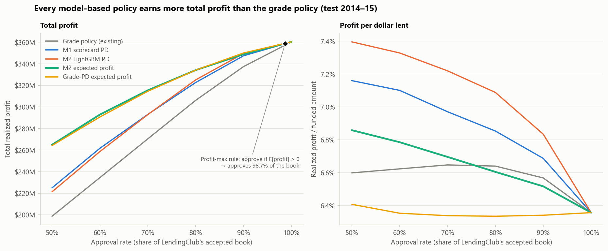
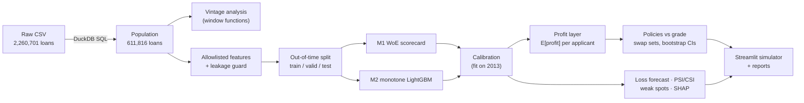
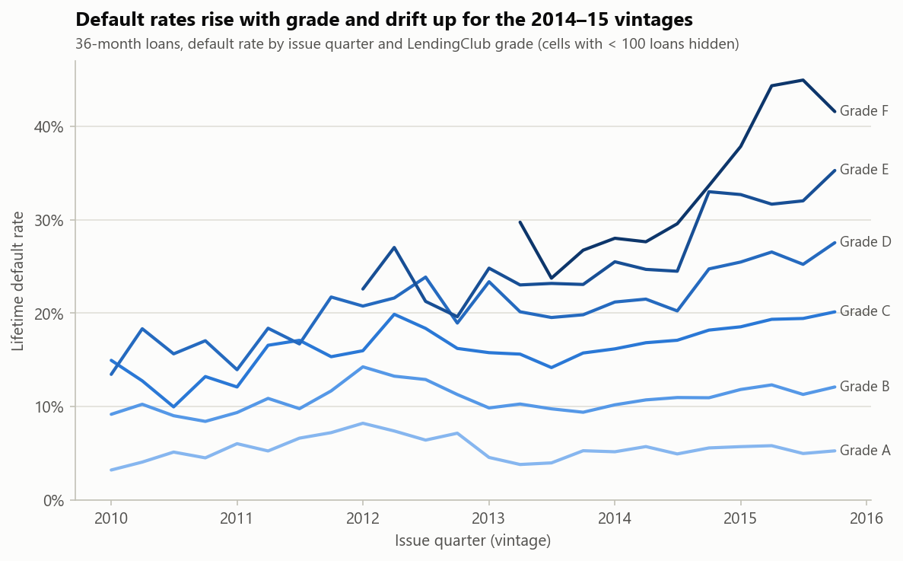
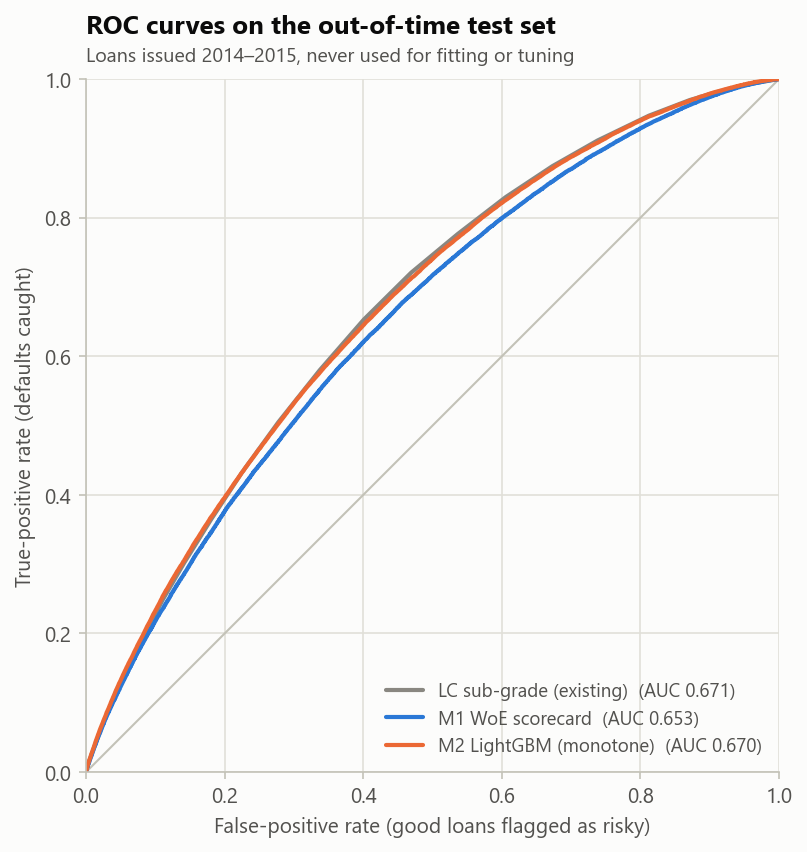
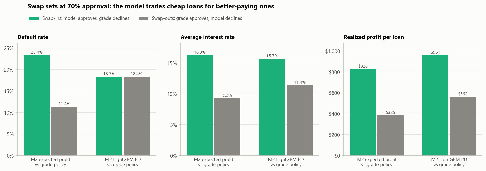
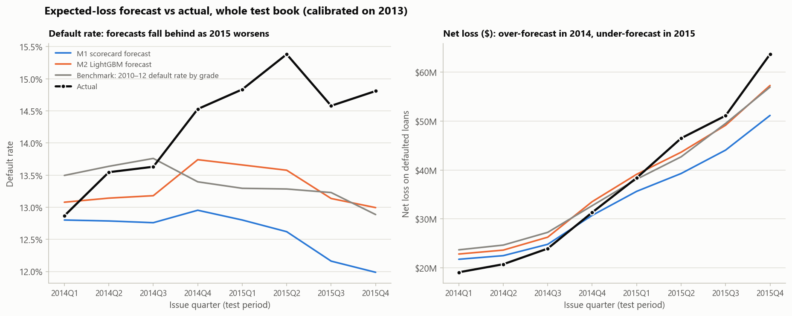
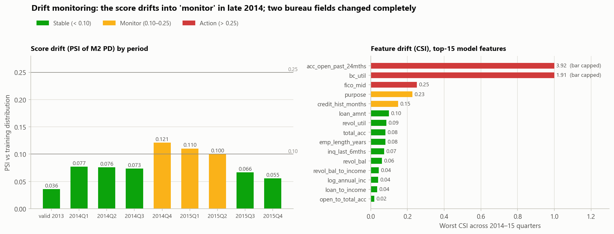
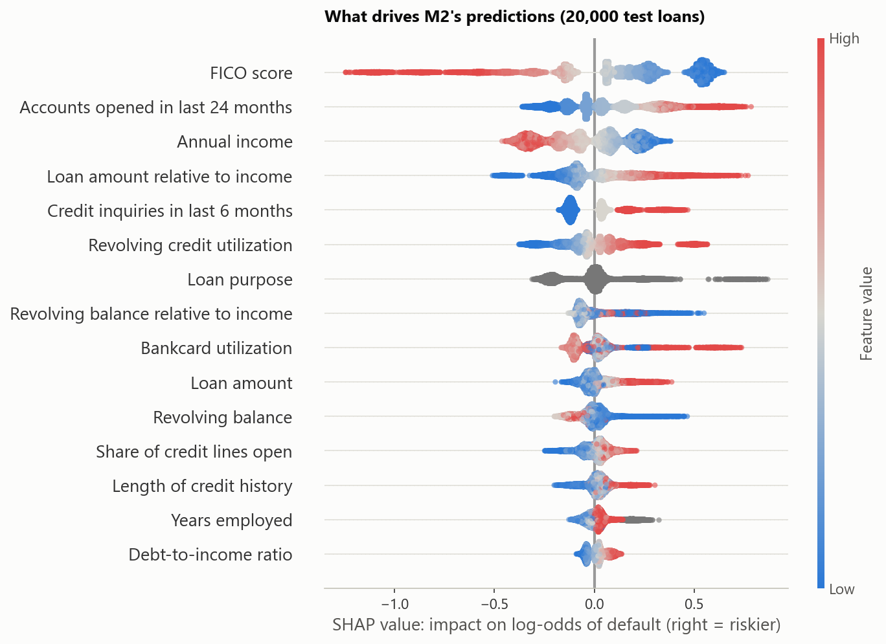

<!-- Generated by src/credit_engine/report.py from reports/metrics/. Edit the template there, not this file. -->

# Profit-Optimized Credit Decisioning Engine — LendingClub

An end-to-end credit decisioning system built on 2,260,701 historical LendingClub loans:
**SQL vintage analysis → default-probability models → a profit-maximizing approve/decline policy → bank-style validation and monitoring → an interactive policy simulator.**

## Business question

> If we were the credit policy team, which applicants should we approve to maximize portfolio profit,
> and how much better is a data-driven policy than LendingClub's existing grade-based one?

## Headline results (out-of-time test: 445,357 loans issued 2014–2015)

| | Result |
|---|---|
| **Profit, same volume and capital** | Ranking applicants by the LightGBM PD instead of LendingClub's grade earns **+$22.5M (8.3%)** at 70% approval, 95% CI [$20.1M, $24.7M], with the same bad rate (10.5% vs 10.5%) and the same dollars lent (-0.3%) |
| **Profit, expected-profit ranking** | Ranking by expected profit earns **+$44.9M (16.6%)**, 95% CI [$41.7M, $47.9M], but lends 15.8% more dollars |
| **Robustness** | Both model policies beat the grade policy in all 9 loss-severity × cost scenarios (M2 PD: +$22.1M to +$22.8M) |
| **Model benchmark** | LightGBM test AUC **0.670** vs LendingClub sub-grade 0.671: statistically tied (Δ -0.0013, 95% CI [-0.0034, +0.0006]), with the best calibration (Brier 0.1183) and top-decile capture (20.0%) |
| **Loss forecasting** | M2 forecasts quarterly net losses with **9.0% MAPE** (grade benchmark 10.5%) |
| **Monitoring** | Score PSI enters "monitor" in late 2014 (max 0.121); 13 of 51 segments flagged as weak spots, and 12 of 12 were already drifting the same way in 2013 |

**Why the model makes money even though AUC is tied:** where the M2 PD policy and the grade policy disagree,
both sets of loans default at the same rate (18.3% vs 18.4%), but the loans M2 picks
pay 15.7% interest instead of 11.4%, earning $961 vs $562 per loan.
M2 finds loans that LendingClub priced as riskier than they turned out to be.



## Data and population

- Source: Kaggle [`wordsforthewise/lending-club`](https://www.kaggle.com/datasets/wordsforthewise/lending-club), accepted loans 2007–2018.
- Population: 36-month, individual applications issued 2010-01-01 to 2015-12-01 with a final outcome → **611,816 loans**, default rate 13.9%. Every loan in the window had time to mature before the data cutoff.
- Target: 1 = Charged Off / Default, 0 = Fully Paid.
- **Framing:** only loans LendingClub accepted are observed, so *approval rate* means the share of LendingClub's accepted book we would keep. Every policy here is a **tightening** policy.

| Split | Issued | Loans | Default rate |
|---|---|---|---|
| Train | 2010–2012 | 66,037 | 12.5% |
| Validation | 2013 | 100,422 | 12.3% |
| Test (touched once) | 2014–2015 | 445,357 | 14.5% |

## Approach



1. **SQL (DuckDB)** loads the 2.2M-row gzipped CSV without pandas, cleans it, defines the population and runs vintage analysis (default rate by quarter × grade, risk-based pricing check, cumulative default curves with window functions).
2. **Features** use an allowlist of application-time fields only. LendingClub's grade, sub-grade, interest rate and installment are *never* features (they are LC's own model), and `zip_code`/`addr_state` are excluded for fair lending (ECOA / Reg B). A code guard and a test enforce it; the strongest single feature (`fico_mid`) has univariate AUC 0.620, far below the 0.80 leakage tripwire.
3. **Models:** B0 = LendingClub sub-grade (benchmark); M1 = WoE logistic scorecard (9 features, 600 points at 50:1 odds, PDO 20); M2 = LightGBM tuned with Optuna. Monotone constraints (FICO −, DTI +, inquiries +, utilization +) cost nothing on validation, so production M2 is monotone. PDs are calibrated on 2013.
4. **Profit layer:** `E[profit] = (1 − PD)·r_good[sub-grade]·amount − PD·L[grade]·amount − cost`, with returns and loss rates estimated on 2010–12 only; realized profit = payments × (1 − 1% servicing fee) − funded amount.
5. **Validation:** paired bootstrap CIs, loss forecast vs actual by quarter, PSI/CSI drift, segment weak-spot mining with an early-warning check, SHAP reason codes.

## Model benchmark (test 2014–15)

| Model | AUC | Gini | KS | Top-decile capture | Brier |
|---|---|---|---|---|---|
| LendingClub sub-grade (existing) | 0.671 | 0.342 | 0.252 | 19.5% | 0.1193 |
| M1 WoE scorecard | 0.653 | 0.306 | 0.221 | 19.1% | 0.1196 |
| M2 LightGBM (monotone) | 0.670 | 0.340 | 0.245 | 20.0% | 0.1183 |

On 2013 validation both models beat the grade (M2 0.669, M1 0.652 vs 0.649); by 2014–15 LendingClub's grade had caught up.

## Key charts

| | |
|---|---|
|  |  |
|  |  |
|  |  |

## How to run

```bash
pip install -r requirements.txt
pip install -e .
# data: kaggle datasets download -d wordsforthewise/lending-club -p data/raw --unzip
#   (or place accepted_2007_to_2018Q4.csv.gz in data/raw/ manually)
python -m credit_engine.run_all        # raw file -> every metric, chart and report (~10 min)
python -m pytest                       # tests
streamlit run app/streamlit_app.py     # policy simulator
```

`make setup`, `make all`, `make test` and `make app` wrap the same commands. The notebook
[`notebooks/credit_decisioning_walkthrough.ipynb`](notebooks/credit_decisioning_walkthrough.ipynb) walks through every result (`pip install jupyter` to run it).

## Interactive app

`streamlit run app/streamlit_app.py`: overview, vintage explorer, model benchmark, **policy simulator** (approval-rate slider, policy, loss-rate multiplier and cost per loan, with deltas vs the grade policy), drift and weak spots, and "explain a decision" with reason codes.
The app only reads `app/data/` (precomputed, 445,357 test loans), so it deploys directly to Streamlit Community Cloud (entry point `app/streamlit_app.py`).

## Limitations

- **Accepted loans only.** No reject inference is possible (rejected applications have no outcomes), so policies can only tighten LendingClub's book.
- **Simplified profit.** No time value of money or funding cost; the 1% servicing fee and cost per loan are assumptions covered by the sensitivity analysis. With a funding cost, low-rate loans look less attractive and the profit-max rule (which approves 98.7% of the book) would decline more.
- **Different economics.** LendingClub is a peer-to-peer installment lender, not a bank card issuer: the method transfers, the exact numbers do not.
- **One benign credit period** (2010–2015), with no recession in the test window.
- **Coarse loss rates**, estimated by grade only.
- **Calibration drift:** PDs calibrated on 2013 under-predict 2015 defaults (13.3% predicted vs 14.5% actual across the test period); the monitoring section shows how it would have been caught.
- **The expected-profit ranking** earns the most but lends more capital into riskier, larger loans; most of its gain comes from the decision rule rather than the model (the same rule with the grade-based PD earns +$44.0M).

## Repository map

```
config.yaml                 every date, threshold and parameter
sql/                        01_load, 02_clean, 03_vintage, 04_features (DuckDB)
src/credit_engine/          data, features, splits, scorecard, models, evaluation, profit,
                            forecasting, monitoring, explain, plots, report, run_all
app/streamlit_app.py        policy simulator (reads app/data/ only)
notebooks/                  walkthrough notebook
reports/metrics/            every number (single source of truth)
reports/figures/            every chart
reports/results.md          all result tables (generated)
reports/business_memo.md    one-page recommendation (generated)
tests/                      leakage, population, splits, profit, policy, PSI, metrics
PROGRESS.md                 decision log
```
